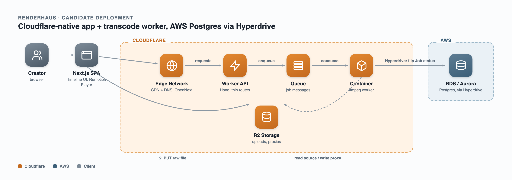
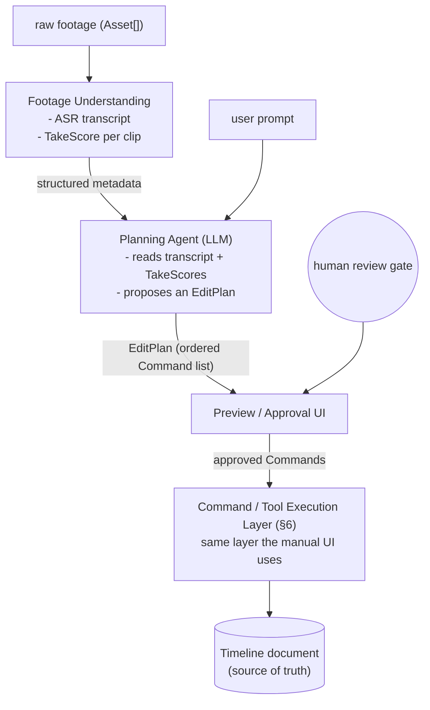
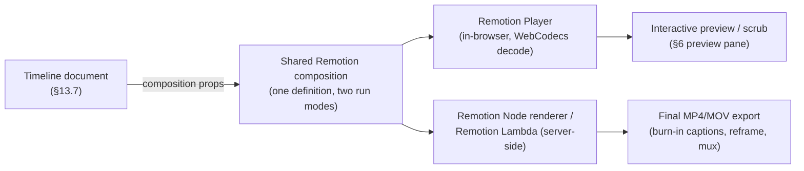

# Renderhaus v0 — Architecture

Status: planning draft, no code yet (except the timeline-render spike below, which carries forward).

This doc has two parts. **Part I (§1–12)** is the product-level plan. **Part II (§13–15)** is a deep-dive design document for the v0 feature specifically — main components, the research behind each architectural choice, and a best-practices checklist, written for a first build of a video editor.

---

# Part I — Product Plan

## 1. Product Vision & Audience

A web-based, AI-native video editor for content creators who care about their visual craft and have (or are building) a distinctive, personal editing style — think Casey Neistat's kinetic jump-cut vlogging, or a food creator with a specific shot rhythm, or any creator whose edits are recognizably *theirs*. Entirely browser-based, cloud rendering, no download — the Figma comparison: fast, precise, zero perceptible lag between action and result.

**This audience shapes the whole roadmap.** They are not looking for a template to wear — they're looking for the mechanical drudgery between raw footage and a finished cut to get out of their way faster, so more of their time goes into the craft decisions that make their work theirs.

**Design touchstone: [Cargo.site](https://cargo.site).** Where the Figma comparison above is about interaction feel (fast, precise, no lag), Cargo is the reference for aesthetic sensibility and audience respect — a site builder built *by and for* designers and artists, whose stated purpose is helping creative people show work well enough to land clients/jobs, anchored by a network of peers showcasing great work. Keep that posture in mind wherever it's relevant going forward: this is a tool for people who notice craft, so the tool itself should read as made by people who notice craft too — not a general-purpose SaaS skin. Not a scope change, no new feature implied by this — a standing design/brand reference, the same way the Figma line is.

## 2. v0 Feature Decision: Hire-an-Editor, Not Style-Transfer

Earlier drafts of this plan led with link-based style transfer (paste a reference video, extract its edit skeleton, apply it to your footage). On reflection, that's the wrong wedge for this audience, for a reason worth recording so it doesn't get re-litigated later:

- **Style transfer from someone else's video is copy-paste, not craft support.** For an audience whose identity is built on having a *distinctive* style, templatizing someone else's cuts works against the product's own positioning.
- **Style transfer from a creator's own past videos** ("learn my pattern, reapply it to new footage") is a legitimately different, more aligned feature — personalization/consistency-at-scale, not mimicry. It's shelved for a later phase (§7), not dropped.
- **"Hire an editor"** — raw footage + a prompt → a first draft on a fully editable timeline — respects that the creator already has the eye. It removes the assembly grind, not the creative decisions. It's also the more direct build: it's the Command layer (§6) with an LLM driving it, no new ingest/legal-risk pipeline required.
- OpusClip-style long-form repurposing is a different ICP (podcasters/streamers optimizing reach) and is out of scope.

**Decision: v0 ships the editing engine (Layer A) and the hire-an-editor agent orchestrator (Layer B) together.** Style transfer, b-roll generation (à la Cleo Abram / Howtown / 3Blue1Brown), and everything else move to post-v0.

## 3. Competitive Landscape

Researched July 2026.

| Product | What it does | Relevant to us |
|---|---|---|
| **Browser-based "hire an editor" agents** (closest direct competitors) | Chat box / single prompt drives a real multi-track timeline agent ("cut the silences," "make a 30s highlight"), manual editing stays available alongside the agent; one variant uses "hire an editor" framing near-identical to ours, turning raw clips into a paced, captioned, mixed cut on an editable timeline. | Validates agent-drives-real-timeline as a paying-customer architecture, and that the "hire an editor" framing (§2) resonates enough that others have landed on it independently. Worth using as a direct usability benchmark once we have something to compare. |
| **Descript** | Transcript-driven editing (delete a word, the clip cuts); hybrid cloud/local architecture — ASR + generative rendering on AWS GPU, timeline UI local via WebGPU for low-latency feedback. Forced-alignment engine maps ASR text to millisecond timecodes. | Validates transcript-driven editing as a proven interaction pattern (§13.3), and its local/cloud split is a direct precedent for our WebCodecs-local / render-server-cloud split (§13.6). |
| **CapCut Templates** | Curated "use this template" — manual, not automated extraction. | Confirms nobody has automated style extraction from an arbitrary link either — but that's no longer our v0 wedge, so it's informational only now. |
| **OpusClip / Vizard / Klap** | Paste a long-form link → auto-generates short vertical clips. | Different ICP (confirmed out of scope, §2). |
| **Kapwing / Flixier / Veed / CapCut Web** | Browser-based, multi-track timeline, cloud render, some real-time collaboration. | Confirms browser-based/no-download is 2026 table stakes, not a differentiator by itself. |

Sources: [notta.ai Descript review](https://www.notta.ai/en/blog/descript-review).

---

## 4. MVP Scope (v0)

**Layer A — Editing primitives** (the engine, must be solid before any agent touches it). Status reflects the actual repo, not the plan — checked once real code backs it, not once it's merely scaffolded:
1. Import (upload) — **[BUILT]** drag-drop or file picker, sequential append onto the video track, proxy-transcoded on the way in (§11)
2. Multi-clip timeline: trim / split / arrange (reorder, ripple-delete) — **[PARTIAL]** only `addClipCommand` exists (`web/src/lib/timeline/commands.ts`); trim/split/reorder/ripple-delete Commands aren't written yet, so today's timeline is append-only
3. Text: titles, word-timed subtitles/captions — **[PLANNED]** the Captions/Text tabs are stubs in `IconRail.tsx` — visible, wired to nothing
4. Transitions (small fixed set — cut, fade, dip-to-black; not a VFX library) — **[PLANNED]** same stub-tab status
5. Export (aspect-ratio presets, burn-in captions) — **[PLANNED]** the Export button exists in `TopBar.tsx`, disabled, titled "Not built yet"

Every one of these is (or, once written, will be) an invertible **Command** (§6) from day one — that part of the design already holds for the one Command that exists.

**Layer B — Hire-an-editor, on top of Layer A** — **[PLANNED]**, no code yet for any of this:
6. Footage understanding: transcript (ASR) + per-clip/per-take quality signals (§13.3)
7. Planning agent: prompt → editing plan → sequence of Layer-A Commands (§13.4)
8. Preview/approval UI: see the plan before it lands, undo any applied step individually

**Explicitly deferred:** style transfer (self or reference-based, §7), animated concept b-roll generation, webcam/talking-head in-app recording, speaker-tracked auto-reframe, multiplayer collaboration, publishing/CMS integration.

---

## 5. High-Level Architecture

Plain-text block diagram, deliberately not Mermaid — renders correctly in any viewer, including ones without diagram support. `[BUILT]` marks something that exists in the repo today; `[PLANNED]` marks a component this doc commits to but that isn't code yet. Where "today" behavior differs from the eventual managed-infra design, it's called out inline rather than left implicit.

```
┌────────────────────────────────────────────────────────────────────────────┐
│ Browser — Next.js editor SPA                                       [BUILT] │
├────────────────────────────────────────────────────────────────────────────┤
│ Timeline track/arrangement UI — Canvas 2D + time ruler (§6)        [BUILT] │
│ Preview pane — Remotion Player, WebCodecs-backed decode (§13.6)    [BUILT] │
│ Timeline document — Zustand store, OTIO-inspired (§13.7);                  │
│   also serves as the Remotion composition props                    [BUILT] │
│ Chat / prompt panel                                              [PLANNED] │
└────────────────────────────────────────────────────────────────────────────┘
   │  CRUD on project/timeline, job enqueue, asset upload
   ▼
┌────────────────────────────────────────────────────────────────────────────┐
│ Next.js API routes (thin)                                                  │
├────────────────────────────────────────────────────────────────────────────┤
│ POST /api/transcode — synchronous ffmpeg proxy transcode on                │
│   import; local-dev only, no job queue/progress yet (§11)          [BUILT] │
│ auth, project/timeline CRUD                                      [PLANNED] │
└────────────────────────────────────────────────────────────────────────────┘
   ▼
┌────────────────────────────────────────────────────────────────────────────┐
│ Agent orchestrator                                               [PLANNED] │
├────────────────────────────────────────────────────────────────────────────┤
│ LLM tool-calling loop (§13.4) — emits the same Command                     │
│   objects the manual UI emits                                              │
└────────────────────────────────────────────────────────────────────────────┘
   ▼
┌────────────────────────────────────────────────────────────────────────────┐
│ Managed job orchestration (Inngest / Trigger.dev)                [PLANNED] │
├────────────────────────────────────────────────────────────────────────────┤
│ Managed ASR inference (vendor TBD, not yet researched)                     │
│   -> transcript                                                  [PLANNED] │
│ Footage-understanding scoring (§13.3)                                      │
│   -> per-clip TakeScore metadata                                 [PLANNED] │
│ Remotion render (self-hosted Node renderer or Remotion Lambda)             │
│   same composition as the Preview pane above                               │
│   -> final export (burn-in captions, reframe, mux)               [PLANNED] │
└────────────────────────────────────────────────────────────────────────────┘
   ▼
┌────────────────────────────────────────────────────────────────────────────┐
│ Object storage (S3 / Cloudflare R2)                              [PLANNED] │
├────────────────────────────────────────────────────────────────────────────┤
│ raw uploads, proxies, exports                                              │
│ today: transcoded proxies land in web/public/proxies/ on disk              │
│   as a local-dev stand-in — see §11                                        │
└────────────────────────────────────────────────────────────────────────────┘
   ▼
┌────────────────────────────────────────────────────────────────────────────┐
│ Managed Postgres (Neon / Supabase)                               [PLANNED] │
├────────────────────────────────────────────────────────────────────────────┤
│ project / timeline / job metadata                                          │
│ today: timeline document lives only in the browser's Zustand               │
│   store — no persistence yet                                               │
└────────────────────────────────────────────────────────────────────────────┘
```

Fully managed infra is still the target for v0 — no servers to operate. The one exception today is `/api/transcode` itself: a real (if thin) Next.js server route shelling out to local `ffmpeg`, which is why it's marked `[BUILT]` rather than folded into the still-`[PLANNED]` job-orchestration box below it — see §11 for the scope note on exactly what that route does and doesn't do yet. The hard, unproven part of this product remains the timeline engine + orchestrator, not server ops.

Note the split this diagram makes explicit: the **track/arrangement UI** (drag, trim, split, reorder clips — the editing chrome) is custom Canvas 2D, already spiked in `spikes/timeline-render/` and now live in `web/src/components/editor/timeline/`. The **preview pane** (what the edit actually looks like, frame-accurate, at the current playhead) and the **final render/export** are both Remotion, rendering the *same* composition definition in two modes — interactive (`Player`, in-browser, `[BUILT]`) and headless (Node renderer / Lambda, server-side, `[PLANNED]`). See §10.1 and §13.6 for why this replaces a separate third-party render-API vendor entirely.

**Deployment target, illustrated.** The block diagram above is deliberately vendor-agnostic (it's the timeline/orchestrator shape, true regardless of where it runs). The diagram below is the concrete candidate from §10.2 — Cloudflare for the app/edge/queue/storage/transcode-worker, AWS for Postgres only, connected via Hyperdrive:



---

## 6. Frontend Architecture

- **Next.js (App Router) + TypeScript.**
- **Timeline/canvas engine: Canvas 2D, not DOM-per-clip — for the track/arrangement chrome only.** Already validated in `spikes/timeline-render/` — Canvas 2D and PixiJS both hold flat 60fps regardless of clip count via viewport culling/GPU scene graph; unvirtualized DOM degrades under load. Decision stands, carries forward unchanged. This is the drag/trim/split/reorder surface — it does not do the actual video compositing.
- **Preview compositing: Remotion `Player`, backed by WebCodecs decode — not a hand-rolled Canvas/WebGL compositor, not ffmpeg.wasm.** The timeline document (§13.7) is passed as composition props to a Remotion component tree; Remotion's `Player` renders it frame-accurate in the browser for scrub/preview. Deep-dive with trade-off table in §13.6.
- **Chat/prompt panel** sits alongside the timeline, not instead of it — agent actions are visible as they apply, so the user always sees and can immediately undo what the agent did.
- **Document model:** normalized timeline (tracks, clips, captions, transcript) in a single client store — **built with Zustand** (`web/src/lib/timeline/store.ts`), modeled on an OpenTimelineIO-inspired schema — deep-dive in §13.7. In-memory/client-only today, no persistence — becomes the client half of the Postgres-backed round-trip in §8 once that lands.
- **Undo/redo as first-class:** every mutation — UI or agent — is an invertible Command. Not optional infrastructure; see §13.4 for why this is what makes agent-driven editing trustworthy. **Built** as the mechanism (`store.ts`'s `past`/`future` stacks, `commands.ts`'s `Command` interface), but only one Command exists so far (`addClipCommand`) — see §4's Layer A status.
- **Proxy-based editing:** never scrub/edit against original high-res uploads; transcode to proxy on upload, touch source resolution only at export. **Confirmed as a hard requirement, not just a performance nicety** — a real ProRes 422 `.mov` (the default FCP export codec, per §1's audience) loaded straight into a `<video>` element plays its PCM audio track fine but renders zero frames, silently, because Chrome has no ProRes decoder at all. Proxy transcode isn't optional for "feels fast," it's required for "plays at all" the moment a user brings in footage from a real NLE. **Built** as a local-dev draft (`/api/transcode`, §11) — every import is transcoded today, just not yet through managed infra.

---

## 7. Deferred: Style Transfer (Self-Style)

Not v0, kept here so the idea doesn't get lost: once a creator has used Renderhaus enough that we have a history of their own edited projects, extract *their own* recurring pattern (cut pacing, caption style, transition choices) from their own past work and offer it as a reusable starting point for new footage. This is the "learn my style" reframe from §2 — personalization, not mimicry of someone else's video. Needs a body of the user's own edit history to exist first, so it's naturally sequenced after v0 ships and gets used, not before.

Reference-video-link ingest (pulling someone else's TikTok/Reel) is not planned at all currently — the legal/ToS exposure (no first-party download API for arbitrary TikTok/IG URLs) isn't worth taking on for a feature that cuts against the product's own positioning.

---

## 8. Backend / Data Model

| Entity | Purpose |
|---|---|
| `Project` | A user's editing session/container |
| `Asset` | An uploaded raw clip (+ generated proxy) |
| `Track` | A layer in the timeline (video, audio, captions, overlays) — OTIO-inspired |
| `Clip` | An instance of an `Asset` placed on a `Track` with in/out points |
| `Transition` | Between two adjacent items on a track (cut/fade/dip) — modeled as its own object per OTIO convention, not a clip property |
| `Transcript` | Word-level timestamps from ASR, tied to an `Asset` |
| `Caption` | A styled overlay derived from `Transcript`, placed in time |
| `TakeScore` | Per-clip/per-segment quality signals (audio clarity, transcript confidence, framing) feeding the planning agent — §13.3 |
| `EditPlan` | An agent-proposed sequence of Commands, shown to the user before/as it applies — §13.4 |
| `Job` | Async work unit: transcode-proxy, transcribe, score-takes, render-export |
| `ExportPreset` | Target aspect ratio / platform spec |

Timeline document is the editable source of truth (Postgres, versioned JSON or normalized rows — TBD Phase 1), round-tripped with the browser. All heavy work goes through a `Job`. Client polls for v0; move to realtime push only if polling feels janky.

---

## 9. AI Pipeline

- **ASR:** feeds captions, transcript-driven editing, and take-scoring. Model/inference vendor **not yet determined** — §10's table previously implied Whisper via Replicate/fal.ai/Modal was decided; it wasn't, that was an unresearched placeholder.
- **Take/shot scoring:** structured signals (transcript confidence, silence/filler density, audio clarity), not embedding-based retrieval — rationale in §13.3.
- **Planning agent:** LLM tool-calling against the Command set (§6, §13.4) — **model/provider is a user-facing choice**, not a fixed architecture decision; the Command-set contract itself is provider-agnostic, so nothing here depends on which model a given user picks.
- **Caption styling:** deterministic typography/timing templates applied to ASR output — no model needed.
- **Silence/filler detection:** derived from ASR word-timestamp gaps + filler-word list.

---

## 10. Infra Decisions

| Layer | Choice | Notes |
|---|---|---|
| Hosting | ~~Vercel~~ **Cloudflare (Workers, via OpenNext)** — **[PLANNED]** | Next.js app; not Vercel. See §10.2. |
| Object storage | ~~S3 or Cloudflare R2~~ **Cloudflare R2** — **[PLANNED]** | uploads, proxies, exports; R2 over S3 since the compute is Cloudflare-side too (zero egress fees between R2 and Workers/Containers) |
| Database | **AWS RDS or Aurora (Postgres)**, accessed from Workers via Cloudflare Hyperdrive — **[PLANNED, open to reconsideration]** | The Container reaches RDS *directly*, not via Hyperdrive — see §10.2/§10.3. **Not a closed decision** — Neon (serverless Postgres, edge-native driver, sidesteps the Hyperdrive↔RDS friction found during transcode-worker research) and Cloudflare D1 (max vendor consolidation, SQLite semantics) are real alternatives worth weighing before this is load-bearing; revisit if no concrete AWS-specific reason (compliance, existing tooling) surfaces. |
| Auth | **Google Sign-In (OAuth)** — most likely, not yet fully committed | Supersedes the earlier Supabase Auth / Clerk framing |
| AI inference (ASR) | **Not yet determined** | Do not assume Replicate/fal.ai/Modal — no research has actually been done on this choice yet; removed from being implied as decided |
| Render workers | Remotion — self-hosted Node renderer or Remotion Lambda, over operating raw Modal/ffmpeg workers or a third-party render-API vendor | see §10.1 for why. Renderer *host* is now an open question again given §10.2 — a self-hosted Node renderer could run in a Cloudflare Container instead of Remotion Lambda on AWS, see §11 |
| Job orchestration | ~~Inngest or Trigger.dev~~ **Cloudflare Queues** — **[PLANNED]** | GA 2026, 5,000 msg/s — see §10.2. Chosen over Inngest/Trigger.dev because it's native to the Cloudflare side rather than a third vendor |
| Transcode/job worker | **Cloudflare Containers** — **[PLANNED]**, decided over AWS Lambda / Fly.io Machines after deep comparison | GA April 2026, active-CPU billing, scales to zero — runs the same `ffmpeg` command as the local-dev draft (§11), just off the request path. Full comparison in §10.2. |
| Orchestrator LLM | **Multi-model, user-selectable** — not locked to a single provider | The planning agent's model is a user-facing choice, not an architecture decision; the Command-set tool-calling contract (§6, §13.4) is provider-agnostic by design, so this doesn't constrain the engine either way |

### 10.1 Build vs. Buy: The Render Step

Question worth a real answer, not just a hunch: given products like Shotstack, Creatomate, IMG.LY CE.SDK, Editframe, Plainly, Cloudinary, and JSON2Video all market themselves as "video editing APIs," could Renderhaus just be a thin agent layer on top of one of them instead of building an editing engine at all?

**No — but the research sharpens exactly where the line is, and it changes the shape of the render-worker answer above.**

Most of those products are the same shape: send a full JSON description of a timeline, get back a rendered MP4 seconds-to-minutes later. That's a **batch render API** — request/response, no notion of "trim this clip by 3 frames and show me instantly." Most vendors in this space don't offer the other half — low-latency, stateful, scrub-and-see interactive editing — because that fundamentally doesn't fit a REST request/response model.

**Decision: adopt Remotion as the single rendering substrate for both halves**, rather than hand-building a bespoke compositor for preview and separately shopping for a batch-render vendor for export:

- **Interactive half** — Remotion's `Player` is a real frame-seekable, in-browser React component, backed by WebCodecs decode. It renders the *same* composition definition (the timeline document mapped to composition props, §13.7) that gets exported later. This is the preview pane in §5/§6 — not the track/arrangement chrome, which stays custom Canvas 2D.
- **Batch half** — the identical composition renders headlessly via Remotion's own Node renderer (self-hosted) or Remotion Lambda, producing the final MP4/MOV. No translation step to a third-party JSON schema (Shotstack's, Creatomate's, etc.) — the timeline document *is* the render input, in both modes.

This is a meaningfully different bet than "buy the boring batch step" — it means Renderhaus doesn't own the pixel-compositing code at all, in either mode. What we build is the **track/arrangement UI + Command layer + agent orchestrator** (§6, §13.4) that produce and mutate the timeline document; Remotion turns that document into pixels, live or exported. That's a real trade: less differentiated-engine code to own and debug, in exchange for a hard dependency on Remotion's licensing and roadmap — **flag this as a real, not hypothetical, cost**: Remotion is source-available under its own commercial license, not a permissive OSS license, and requires a paid company license past a size/revenue threshold — confirm current terms at [remotion.dev/license](https://www.remotion.dev/license) against team size before this is load-bearing infra, and revisit if the terms or our scale change. Logged as an open risk in §11, not a blocker for v0.

**Second question worth recording:** could Renderhaus itself eventually become "editing as an API" for *other* people's agents? Plausibly, and it's close to free — because §6 already commits every mutation to be an invertible, typed Command, the engine is already shaped like something that's trivially exposable as a headless API or MCP server later (same pattern as the Premiere Pro MCP / reap.video prior art). Not a v0 concern, not a redesign if we ever want it — just an option that falls out of a decision already made for other reasons. Logged as a Phase 6+ direction in §12.

### 10.2 Deployment Target: Cloudflare + AWS Postgres

**Decided**: hosting is **not Vercel** — the Next.js app deploys to Cloudflare, Postgres lives on AWS (RDS/Aurora), and — as of this pass — the transcode worker specifically is **Cloudflare Containers**, chosen over AWS Lambda, Fly.io Machines, Modal, and managed transcode APIs after the deep comparison below. What's still open: the exact API-layer shape (Hono Worker vs. Next.js Route Handlers, see the question at the end of this section) and satellite pieces (auth provider, IaC tooling) untouched by this decision.

```
┌────────────────────────────────────────────────────────────────────────────┐
│ Browser                                                                    │
├────────────────────────────────────────────────────────────────────────────┤
│ requests a pre-signed upload URL, then PUTs the raw file                   │
│   directly — never sends the file through app compute                      │
└────────────────────────────────────────────────────────────────────────────┘
   │  1  request upload URL
   ▼
┌────────────────────────────────────────────────────────────────────────────┐
│ Worker — thin route (Hono or Next.js Route Handler)              [PLANNED] │
├────────────────────────────────────────────────────────────────────────────┤
│ issues the pre-signed R2 URL; on upload-complete, writes a                 │
│   Job row and enqueues a message                                           │
└────────────────────────────────────────────────────────────────────────────┘
   │  2  PUT raw file directly to R2
   │  3  enqueue { assetId, r2Key }
   ▼
┌────────────────────────────────────────────────────────────────────────────┐
│ Cloudflare R2  +  Cloudflare Queue                               [PLANNED] │
├────────────────────────────────────────────────────────────────────────────┤
│ R2: raw upload lands here, zero egress to Cloudflare compute               │
│ Queue: buffers the job so an idle worker can't drop it                     │
└────────────────────────────────────────────────────────────────────────────┘
   │  4  consumer picks up the message
   ▼
┌────────────────────────────────────────────────────────────────────────────┐
│ Cloudflare Container                                             [PLANNED] │
├────────────────────────────────────────────────────────────────────────────┤
│ real Linux sandbox — pulls from R2, runs the identical                     │
│   ffmpeg command as the local-dev draft (§11), writes proxy                │
│   back to R2. Active-CPU billed, scales to zero. Connects directly         │
│   to RDS below — not through Hyperdrive, which is a Workers-isolate        │
│   feature a long-lived container process doesn't need or benefit from      │
└────────────────────────────────────────────────────────────────────────────┘
   │  5  flip Job status, record proxy key
   ▼
┌────────────────────────────────────────────────────────────────────────────┐
│ Postgres — AWS RDS / Aurora, via Hyperdrive                      [PLANNED] │
├────────────────────────────────────────────────────────────────────────────┤
│ the one piece that stays on AWS. Hyperdrive is used by the Worker          │
│   (a real Workers isolate) — the Container reaches RDS directly            │
└────────────────────────────────────────────────────────────────────────────┘
   │  6  poll or push
   ▼
┌────────────────────────────────────────────────────────────────────────────┐
│ Browser                                                                    │
├────────────────────────────────────────────────────────────────────────────┤
│ sees the Job flip to done, plays the proxy straight from R2                │
└────────────────────────────────────────────────────────────────────────────┘
```

This diagram is also rendered as a PNG in §5 for a more visual pass over the same pipeline.

This replaces the generic "Managed job orchestration (Inngest/Trigger.dev)" + "Object storage (S3/R2)" boxes in §5's block diagram — not done yet, kept as a deliberate TODO since §5's diagram mixes BUILT/PLANNED status for the whole repo and this section's detail would clutter it before more of this pipeline actually exists as code.

**Why Cloudflare Containers as the worker**, against the alternatives actually researched:

| Option | New vendors | Pricing | Job ceiling | Best fit / caveat |
|---|---|---|---|---|
| **Cloudflare Containers** | +0 (same as frontend) | Active-CPU billing, scales to zero | No hard ceiling | Same account as the frontend, R2, and Queues — one bill, no cross-cloud IAM. GA since April 2026. |
| AWS Lambda + ffmpeg container | +1 (AWS) | Per-ms compute, $/GB-s | 15 min, 10GB `/tmp` | Fits if the team ever wants everything in one AWS account. Long source files need Step Functions chunking. |
| Fly.io Machines | +1 (Fly.io) | Per-second, full VM | No hard ceiling | Proven for exactly this "spin up, run ffmpeg, shut down" pattern — but a third vendor. |
| Modal | +1 (Modal) | Per-second, GPU-first | Configurable | Only worth it once GPU work (vision-based TakeScore, §13.3) shows up. Overkill for CPU-only ffmpeg today. |
| Managed API (MediaConvert / Coconut / Mux) | +1 (vendor) | $0.0075–0.025+/min | N/A, fully managed | Zero ops at low volume. MediaConvert dropped patent indemnification Feb 2026 — a real legal line-item under a commercial product. |

**Decided: Cloudflare Containers.** A follow-up deep-research pass (three independent research tracks, one per option) reinforced this rather than complicating it — cold-start tail latency is worse than Cloudflare's marketing suggests (up to ~58s observed in independent benchmarking, not the advertised 1–3s) but tolerable for an async queue-driven job; Fly.io's case actually *weakened* under scrutiny (2026 reliability incidents on a majority of days in some tracked months, no SLA, and the "one ephemeral Machine per batch job" pattern isn't a supported first-class workflow — the only reference implementation found was an unmaintained hobby repo); AWS Lambda stayed solid on tooling maturity but carries a real structural cross-cloud tax (a static AWS credential would have to live in Cloudflare's secret store, and R2's "S3-compatible" API has documented compatibility gaps with the AWS SDK). Two concrete action items that came out of that research, independent of which worker was picked:
- **A live CVE is directly on point**: CVE-2026-8461 ("PixelSmash") is a real ffmpeg MagicYUV-decoder RCE, fixed in `ffmpeg 8.1.2` (June 2026) — pin a patched ffmpeg and consider a decoder allowlist (only the codecs real cameras/phones produce) regardless of worker choice.
- **The Container connects to RDS directly**, not through Hyperdrive — Hyperdrive solves the stateless-Workers-isolate connection-pooling problem; a Container is a long-lived process with no such problem, and there's a live unresolved Hyperdrive↔RDS GitHub issue reinforcing that Hyperdrive isn't the intended path here. Reflected in the §10.2 diagram above.

**Open question this raises, not yet answered — see §11:** does the Next.js Route Handler layer still make sense once the app deploys to Cloudflare via OpenNext? Route Handlers there run through OpenNext's compatibility shim — exactly the layer where gaps like the `child_process` stub (§11) live — and the actual heavy work (transcode, eventually render/ASR) is *already* moving out of Next.js entirely, onto Workers/Queues/Containers directly. What's left inside Next.js is genuinely thin (auth, project/timeline CRUD, job enqueue) — the shape Hono (Cloudflare's own recommended lightweight framework for Workers) is built for, with no OpenNext translation layer in the way at all. Candidate alternative: Next.js stays purely the client SPA (no Route Handlers), and a separate Hono Worker owns every backend route. Not decided — logged as an open question, not implemented.

---

### 10.3 Transcode Worker — Production Design

The local-dev draft (§11) proves the `ffmpeg` command is right; it isn't a production design, and shouldn't be mistaken for one. This section is that design — for the Cloudflare Container worker in §10.2's pipeline, but the shape holds regardless of which worker option ends up chosen.

**Job state machine.** A `Job` row (§8) is the source of truth, not the queue message — queues give at-least-once delivery, never exactly-once, so the row (not "did a message arrive") is what decides whether work has actually happened:

```
queued ──▶ processing ──▶ done
              │
              ▼
            failed ──▶ (retries remain) ──▶ queued
              │
              └──▶ (retries exhausted) ──▶ dead_letter
```

- **`queued`**: Job row written, message enqueued. Nothing has run yet.
- **`processing`**: a Container claimed the message and started work. Holds a `startedAt` timestamp so a stuck job (worker crashed without reporting failure) is detectable — a `processing` row older than the timeout with no heartbeat is treated as failed, not silently stuck forever.
- **`done`**: proxy written to R2, `Job.outputKey` recorded, `completedAt` set.
- **`failed`**: ffmpeg errored, timed out, or the container itself crashed. `retryCount` increments; re-enqueued with backoff while `retryCount < MAX_RETRIES`.
- **`dead_letter`**: retries exhausted. Surfaced to the user ("we couldn't process this file") instead of retrying forever — and queued for human inspection, per the research pattern of monitoring DLQ depth as a first-class metric, not an afterthought.

**Idempotency — the part a one-off script never has to think about.** Two failure modes a real queue guarantees you'll eventually hit: the same message delivered twice (at-least-once delivery), and a worker crashing mid-encode and getting retried. Both are handled the same way:

- The **output key is deterministic**, derived from the Job ID, not randomly generated per attempt. Before transcoding, the worker checks whether that key already exists in R2 (a `HeadObject`-equivalent check) — if it does, the job is already done and the worker reports success without re-encoding.
- **ffmpeg's output write is not atomic** — a crash mid-encode leaves a partial, corrupt file at the output path. The worker writes to a temporary key first (`<jobId>.mp4.part`) and only promotes it to the real key (`<jobId>.mp4`) after ffmpeg exits 0. A retry after a crash always starts clean rather than resuming into a half-written file.

**Input hardening** (§11 covers the local draft's specific gaps; here for completeness against the design as a whole) — the real threat model for "run a media decoder against a file a stranger uploaded" isn't shell-escaping, it's **arbitrary code execution via a decoder bug**: assume any format ffmpeg's demuxers touch is a potential exploit surface, not just a place to sanitize strings. Concretely:
- `spawn` with an argv array, never `exec` with a shell string — already true of the local draft, still worth stating as the non-negotiable baseline.
- Extension + MIME allowlist and a size cap, rejected before the file is ever written to disk or handed to ffmpeg.
- `-protocol_whitelist file,pipe` on every invocation — refuses to let a crafted playlist/concat reference inside the file reach any other protocol or path.
- A hard timeout that kills the process — a hung or adversarially slow decode shouldn't be able to tie up a worker indefinitely.
- The Container itself is the last line of defense, not the first: ephemeral, no persistent filesystem across jobs, minimal network egress (it only needs to reach R2), so even a successful exploit inside the ffmpeg process has nowhere useful to go.
- All five of the above are already applied to the local-dev route today (`web/src/app/api/transcode/route.ts`) — they're good practice regardless of which worker ends up running this, not something that waits for §10.2's pipeline to exist.

**Observability** — the metrics worth alerting on from day one, not added after the first incident: job success rate (alert under ~99%), mean encode time per minute of input video (catches silent performance regressions), queue depth (alert if it's climbing — means workers can't keep up), and DLQ depth (should be ~zero; any growth is a real, unhandled failure class). Structured logs per job (`jobId`, state transition, duration, error class) rather than free-text — this is what makes "why did job X fail" answerable without re-running it.

**API contract for job status** — this is where §11's Next.js-API open question and the OpenAPI recommendation (Hono + `@hono/zod-openapi`) meet concretely: `POST /jobs` (enqueue), `GET /jobs/:id` (poll status/progress) should be defined as Zod schemas once, giving the browser a typed client and giving any *other* future consumer (a CLI, a future public API per §10.1's "editing as an API" idea) a real OpenAPI contract for free — not something bolted on later.

---

## 11. Open Questions / Risks

- **Remotion licensing.** Remotion (§10.1, §13.6) is source-available under its own commercial license, not permissive OSS — confirm current terms at [remotion.dev/license](https://www.remotion.dev/license) against team size/revenue before it's load-bearing infra for both preview and export, and re-check if either changes.
- **Agent reliability on non-dialogue footage.** Current SOTA rough-cut approaches are strongest on dialogue/talking-head content and weaker on pure visual continuity and rhythm (§13.1) — v0 should scope expectations accordingly rather than promise general-purpose montage editing.
- **Eval strategy for the planning agent is unbuilt.** LLM prompting is fuzzy and model-specific; needs a fixture-based eval harness (§13.5) before "the agent works" can be claimed with any confidence.
- **Render cost/fidelity is still unvalidated** now that rendering is committed to Remotion (§10.1) — self-hosted Node renderer vs. Remotion Lambda, on cost and cold-start latency at export time, needs a real comparison before Phase 4/5. The Cloudflare-vs-AWS deployment question below adds a third option worth including in that comparison: a self-hosted Node renderer running in a Cloudflare Container alongside the transcode worker, rather than Remotion Lambda on AWS specifically.
- **Deployment target (§10.2) is decided; the managed pipeline itself is still unbuilt.** Cloudflare for hosting/Workers/Queues/Containers/R2, AWS for Postgres only (via Hyperdrive to the Worker, direct connection from the Container) — this is now the plan to build against, not a placeholder. What's still open is the API-layer question immediately below, plus satellite pieces (auth provider, IaC tooling) this decision didn't touch.
- **Next.js API-layer shape is an open question, not yet decided.** Keep Route Handlers in the Next.js app (deployed via OpenNext, inheriting its Cloudflare compatibility gaps — the `child_process` stub below is one instance of this class of problem) — or split cleanly: Next.js as a pure client SPA with no Route Handlers at all, and a separate Hono-based Cloudflare Worker owning every backend route (auth, CRUD, job enqueue) with no OpenNext translation layer involved. The latter is the more likely direction given the actual heavy work (transcode, eventually render/ASR) is already moving out of Next.js entirely — but nothing's implemented against either shape yet.
- **Auth/billing not yet scoped** — starts clean whenever monetization is designed.
- **A/V sync drift** in long-form raw talking-head footage is a real, easy-to-miss failure mode — needs an explicit test methodology, not just "it looked fine in the timeline" (§13.8).
- **Proxy transcode: first draft implemented, local-dev only — not the managed pipeline yet.** Verified directly: a real ProRes 422 `.mov` previously imported with a permanently black frame, audio-only, because Chrome has zero ProRes decode support. Every import now goes through `web/src/app/api/transcode/route.ts`, a Route Handler that shells out to `ffmpeg` on the machine it's running on to transcode to H.264/AAC (capped to the composition's resolution) before the file ever reaches the timeline/Player; if that fails, import falls back to the raw upload and the existing codec-support detection still shows an explicit "preview unsupported" message rather than a silent black box.
  **Scope note, so it's not a surprise later:** this always transcodes on import now (matching §6's "never edit against the original" rule), runs synchronously inline in the import call (fine for short local clips; a multi-minute file will make the "Importing & transcoding…" state last a while, since there's no job queue/progress reporting yet), and depends on `ffmpeg` being on your machine's PATH — none of that's wired to managed infra yet, by design, since that's explicitly later-phase work per this doc (§10.2's candidate Cloudflare Queues + Container pipeline).

---

## 12. Phased Roadmap

- **Phase 0** — this doc. ✅
- **Phase 1** (Layer A engine) — upload → proxy transcode → clip on timeline → trim/split/arrange/playback/export, all as invertible Commands. No AI. Target: a usable manual editor, nothing else.
- **Phase 2** (Footage understanding) — ASR integration, transcript view, transcript-driven delete, silence/filler detection, take-scoring metadata. Still no agent — this phase produces the data the agent needs.
- **Phase 3** (Captions) — styled/animated caption overlay generation, burn-in at export.
- **Phase 4** (Hire-an-editor agent) — planning agent wired to the Phase 1 Command set + Phase 2 metadata: prompt → EditPlan → applied Commands, with preview/approval UI and eval harness (§13.5). **This is the v0 release.**
- **Phase 5** — Export polish: multi-aspect-ratio reframe, platform presets.
- **Phase 6+ (post-v0)** — self-style transfer (§7), animated concept b-roll, collaboration, publishing/CMS, possible headless API/MCP-server exposure of the Command layer for third-party agents (§10.1).

Concrete time budget in §15.

---

# Part II — v0 Deep Dive: Hire-an-Editor Design Document

## 13. Design Document

### 13.1 What "first draft" should actually mean

Worth being explicit about the target, because overpromising here is the single easiest way to lose trust with a craft-focused audience. Industry AI rough-cut tools (Wideframe, Descript, Simon Says, Reduct) land at **roughly 60–75% complete**, cutting assembly time 50–70% — not a finished edit. Academic and commercial approaches alike are documented as **strongest on dialogue-driven content** and measurably weaker at capturing "subtle narrative cues, visual continuity, and expressive rhythms" in pure visual/montage material ([Wideframe rough-cut roundup](https://try.wideframe.com/blog/best-ai-tools-for-rough-cut-assembly/)).

This lines up well with our actual audience: a lot of craft-creator raw footage — vlogging, talking-to-camera, narrated food content — is dialogue-forward. **v0 should target that footage type explicitly** (a talking creator + b-roll, not a silent montage), and the product should frame the output as "first draft" language in the UI, not "final cut" — set the expectation the research says is realistic, don't fight it.

### 13.2 Main Components



Four components, each independently testable: **Footage Understanding** (data in), **Planning Agent** (reasoning), **Preview/Approval** (trust boundary), **Command Execution** (the only way anything actually changes). This mirrors the three-layer split (comprehension → decision → tool execution) used in current academic agentic-video-editing work, which explicitly recommends decoupling reasoning from execution for exactly this kind of flexibility ([arXiv:2509.16811](https://arxiv.org/pdf/2509.16811)).

### 13.3 Footage Understanding — structured metadata, not embeddings-first

**Decision: TakeScore is built from structured signals (ASR confidence, silence/filler density, audio clarity), not primarily from embedding/vector search over footage.**

| Approach | Pro | Con | Verdict |
|---|---|---|---|
| Vector embeddings over frames/transcript | Cheap to stand up, generic, works without domain logic | A solo builder's year-long retrospective on building an AI video editor found embeddings are "fundamentally a compressing technology" that loses nuance, and generic embedding models underperform hybrid approaches combining traditional search with domain-specific logic ([makeartwithpython.com](https://www.makeartwithpython.com/blog/a-year-of-showing-up/)) | Not primary |
| Structured metadata (ASR confidence, word-timing gaps, filler-word counts, audio SNR) | Directly explainable, directly actionable by the planning agent ("this segment has 4 filler words and a 2s dead-air gap"), cheap to compute deterministically | Doesn't capture pure-visual quality (framing, motion) without added vision models | **Primary for v0** — matches dialogue-forward scope (§13.1) |
| Vision-language scene/shot scoring | Needed eventually for visual-quality judgment (composition, camera motion) — this is what the current research frontier (ESA, arXiv:2511.02505) uses shot attributes like size/camera-motion for | Real added cost and complexity, and current tooling is documented as weaker here than on dialogue | Later phase, once dialogue-forward case is solid |

Practical effect: for v0, `TakeScore` is computed deterministically from the ASR output already required for captions (§9) — no new model, no embedding infra, and every score is explainable to the user ("skipped: mostly silence" beats an opaque similarity number).

### 13.4 Planning Agent — plan-then-approve, not autonomous-apply

**Decision: the agent always proposes an `EditPlan` (an ordered list of Commands) before it fully applies; trivial single-step requests can apply directly, multi-step or structurally significant plans require a visible preview.**

This follows both the academic agentic-editing finding that production systems should favor "graceful tool failure handling and human review workflows rather than end-to-end automation" ([arXiv:2509.16811](https://arxiv.org/pdf/2509.16811)), and general AI-agent guardrail practice: pre-execution validation, a human-in-the-loop approval gate for consequential/irreversible actions, and telemetry on every guardrail trigger so failure patterns are visible over time, not just individually shrugged off ([Arthur AI guardrails](https://www.arthur.ai/blog/best-practices-for-building-agents-guardrails)).

Concretely:
- The agent's only tool surface is the Command set from §6 — same contract the manual UI uses. No private "just edit the video" escape hatch.
- Every `EditPlan` is logged (which Commands, in what order, against which prompt) — this log is also the raw material for the eval harness (§13.5).
- Undo is per-Command, not per-plan-as-a-block — a user should be able to keep 4 of the agent's 5 proposed cuts and reject the fifth, the same as they'd revise a human editor's draft.

### 13.5 Eval strategy

LLM behavior here is fuzzy and prompt/model-specific by nature — a public retrospective on building exactly this kind of AI editing product calls this out directly as something to invest real effort in rather than discover after the fact ([makeartwithpython.com](https://www.makeartwithpython.com/blog/a-year-of-showing-up/)). Plan for a small fixture-based eval set from the start of Phase 4, not as an afterthought:

- A handful of real (anonymized/owned) raw-footage + prompt pairs with a written rubric of what a reasonable `EditPlan` should and shouldn't do (e.g., "must not cut mid-sentence," "must remove the two flagged dead-air segments," "should not exceed N cuts for a 60s prompt").
- Run this set on every meaningful prompt/model change, not just ad hoc "it looked fine when I tried it."
- Treat agent misfires the same as any other bug: log which fixture failed and why, don't just re-prompt until it looks right once.

### 13.6 Rendering & Playback Architecture

**Decision: Remotion as the single compositing engine, in two run modes — its `Player` for interactive timeline playback/scrub in-browser (WebCodecs-backed decode underneath), its Node renderer / Remotion Lambda for final export server-side. No in-browser ffmpeg.wasm, no hand-rolled Canvas/WebGL compositor, for anything performance-sensitive.**



| Approach | Pro | Con | Verdict |
|---|---|---|---|
| **WebCodecs** (hardware-accelerated decode/encode, used inside Remotion's `Player`) | Roughly 5–10x faster than software encode for anything beyond short clips; low-latency, good for real-time scrub feedback ([burnsub.com](https://burnsub.com/blog/webcodecs-vs-ffmpeg-wasm/)) | Not universally supported across browsers; limited codec set | **Underlies local preview/scrub** (§6), via Remotion rather than hand-rolled |
| **ffmpeg.wasm** | Handles any format ffmpeg does, works everywhere WASM runs | No GPU acceleration path at all in-browser — every pipeline stage is CPU-bound ([dayverse.id](https://dayverse.id/en/articles/why-ffmpeg-wasm-fails-leverage-gpu-acceleration/)); too slow/unreliable for final export of anything but trivial clips | **Not used for anything performance-critical** |
| **Remotion Node renderer / Remotion Lambda** (server-side) | No browser performance ceiling at all; consistent output regardless of client hardware; renders the *identical* composition the Player just showed the user — no second implementation to keep in sync | Requires the job/proxy pipeline already planned (§5, §10); commercial license, not permissive OSS (§11) | **Final export**, matches current industry practice — "most production editors use WebCodecs for timeline playback/scrubbing, ffmpeg WASM/server for final encode" ([vidstudio.app](https://vidstudio.app/blog/webcodecs-vs-ffmpeg-wasm)) |

This is also exactly the split Descript uses in production (local WebGPU-backed timeline UI, cloud GPU cluster for heavy processing — [notta.ai](https://www.notta.ai/en/blog/descript-review)) and what commercial video-API vendors converge on (client-side interactive preview, server-side REST render — [Creatomate](https://creatomate.com/blog/how-to-build-a-video-editor-in-javascript)). Not a novel choice; a validated industry default — Remotion is simply the specific tool that implements both ends of the split with one shared composition definition, rather than a bespoke compositor on the client paired with a separate vendor JSON schema on the server.

### 13.7 Timeline Data Model — OTIO-inspired, not ad hoc

**Decision: model the internal timeline schema on OpenTimelineIO's structure — `Timeline → Stack of Track → [Clip | Gap | Transition | nested Stack/Track]` — rather than inventing a bespoke shape.**

| Approach | Pro | Con | Verdict |
|---|---|---|---|
| Bespoke ad hoc schema | Fastest to start, no constraints | Every video-editing app that gets this wrong early pays for it later; no vocabulary to reason against; no future interchange path | Rejected |
| **OTIO-inspired schema** (`Timeline`, `Track`, `Clip`, `Gap`, `Transition` as first-class objects) | Industry-standard vocabulary (originated at Pixar, maintained by the Academy Software Foundation, widely supported — [OpenTimelineIO architecture docs](https://opentimelineio.readthedocs.io/en/latest/tutorials/architecture.html)); `Transition` as its own object (not a clip property) turns out to matter once agent-generated plans need to reason about "insert a transition between these two items"; gives us a free future path to import/export real EDLs if we ever need interchange with a pro NLE | Slightly more structure to stand up on day one than the flattest possible shape | **Adopted for the internal model.** Not committing to OTIO's literal file format/library for v0 — just its conceptual shape — so this costs nothing extra now and saves a rewrite later. |

This document is also the render input, not just the editing model: it's mapped directly to Remotion composition props, consumed by the same composition definition in both the `Player` (interactive) and Node renderer/Lambda (export) run modes (§13.6). Keeping it OTIO-shaped rather than Remotion-shaped on the wire means that mapping is a thin adapter, not a rewrite, if the render engine ever changes.

### 13.8 A/V Sync & Frame Accuracy — testing methodology

Easy to get wrong silently: sync can look correct while scrubbing the timeline and still drift after encoding, especially on long-form talking-head footage where small frame-rate/sample-rate mismatches accumulate over minutes ([testdevlab.com](https://www.testdevlab.com/blog/how-to-test-audio-video-sync)). Concrete v0 testing practice, not just "it looked fine":

- Maintain a **sync map** per test asset: three reference moments (start / middle / end) with a distinct audio-visual event (a clap, a visible mouth movement, a spoken cue) whose expected offset is known.
- **Test after encoding, not just on the live timeline** — export a short real test file through the actual render pipeline and re-check the sync map against the output, since drift can be introduced at the transcode/export stage even when the in-browser timeline looked correct.
- Treat any cumulative drift beyond ~1 frame across a multi-minute clip as a pipeline bug, not a rounding error — this is exactly the failure mode that erodes trust in a "hire an editor" feature fastest, because it's invisible until a user notices their captions or cuts are subtly off.

---

## 14. Best-Practices Checklist (video editor, first build)

Distilled from the research above — worth reading as a checklist, not just prose, since this is a first build:

- [ ] **Undo/redo is architecture, decided in Phase 1, not retrofitted.** Every mutation (manual or agent) is an invertible Command from day one (§6, §13.4). Apps at this scale treat undo as core architecture, not a feature ([dev.to command-based undo](https://dev.to/npbee/command-based-undo-for-js-apps-34d6)).
- [ ] **Don't bolt AI onto a traditional NLE UI paradigm.** A public retrospective on building an AI video editor found this constrains discovery of what's actually possible — build the AI-native interaction model in from the start rather than layering it on ([makeartwithpython.com](https://www.makeartwithpython.com/blog/a-year-of-showing-up/)).
- [ ] **Structured metadata before embeddings.** Don't reach for vector search as the default footage-understanding mechanism; it's lossy by nature. Use explainable, deterministic signals first (§13.3).
- [ ] **Remotion (`Player` + Node renderer/Lambda) for both interactive preview and final render, WebCodecs underneath — never ship in-browser ffmpeg.wasm on the critical path** for anything beyond trivial clips (§13.6).
- [ ] **Model the timeline on an industry-standard shape (OTIO-inspired), even if not literally using OTIO** (§13.7) — costs little now, avoids a rewrite later.
- [ ] **Proxy-based editing always** — never scrub or edit against source-resolution media; only touch it at export.
- [ ] **Plan-then-approve for agent actions beyond trivial single steps** — preview before apply, per-Command undo, full action logging (§13.4).
- [ ] **Build the eval harness alongside the agent, not after** — LLM editing behavior is fuzzy and will regress silently on prompt/model changes without one (§13.5).
- [ ] **Test A/V sync after encoding, with a real reference map, not just by eyeballing the live timeline** (§13.8).
- [ ] **Scope the agent's promise to what current tooling actually does well** — dialogue-forward content first; say "first draft," not "final cut," in the product itself (§13.1).

---

## 15. v0 Implementation Timeline

Solo, side-project pace — timeboxes are rough targets to sanity-check scope, not commitments.

| Phase | Scope | Rough budget |
|---|---|---|
| **Phase 1** — Layer A engine | Upload, proxy transcode, timeline (trim/split/arrange), playback, export, full Command/undo-redo layer, OTIO-inspired schema (§13.7) | 3–5 weeks |
| **Phase 2** — Footage understanding | ASR integration, transcript view + transcript-driven delete, silence/filler detection, `TakeScore` (§13.3) | 1–2 weeks (mostly wiring managed ASR + deterministic scoring, no new model training) |
| **Phase 3** — Captions | Styled/animated caption overlays, burn-in at export | 1 week |
| **Phase 4** — Hire-an-editor agent | Planning agent + tool-calling against the Command set, `EditPlan` object, preview/approval UI, action logging, first eval fixture set (§13.4, §13.5) | 3–4 weeks — this is the highest-uncertainty phase; expect iteration on the eval results, not a clean linear build |
| **Phase 5** — Export polish | Multi-aspect-ratio reframe, platform presets | 1 week |

**v0 ships at the end of Phase 4** (Phase 5 can trail slightly after initial usage). Total: roughly **9–13 weeks** of focused solo work, with Phase 4 as the phase most likely to actually take longer than estimated — budget slack there specifically, not evenly across all phases.
