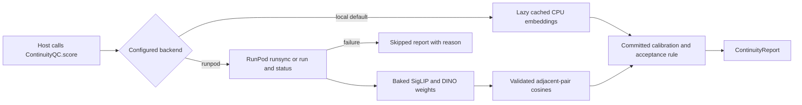

# Run continuity QC on RunPod Serverless

Continuity QC uses in-process embeddings by default. The optional `runpod` backend sends
an ordered frame batch to a RunPod Serverless GPU worker. Failure produces a skipped report
with a reason and `accepted=False`; it does not abort rendering.

## Architecture and decisions



`ContinuityQC` remains the host API. `local_qc` is a policy alias for that integration;
the current runner does not register an executable QC tool or dispatch it through Gateway.
This change adds no generation tool or approval bypass. The installed Deep Agents 0.7.23
signatures were inspected before design. Its middleware and runner configuration stay as-is.

The worker image copies `agent/deep_agent/continuity_qc.py` and its calibration JSON from
the repository at build time. Worker probabilities and decisions use `Calibration.decide`.
The client requests cosines and recomputes the decision with its own configuration,
including threshold overrides and `legacy_min`. There is no second calibration formula.
The default accepts a mean probability of at least 0.5, with a 0.2 per-model drift veto.
Face identity still defaults to `not configured`. The calibration was fitted on film frames;
recalibration on labelled Renderhaus outputs remains required.

The default worker models are `google/siglip-so400m-patch14-384` and
`facebook/dinov2-base`. Models load once at process initialization from baked files.
Build downloads pin the same Hugging Face snapshot revisions used by the existing benchmark.
CUDA inference uses FP16 autocast; CPU inference uses FP32. Both use inference mode and
configurable batches. SigLIP handles the transformers 5 `pooler_output` return shape;
DINO uses the CLS token. Runtime model loading is offline.

The recorded alternatives and choices are in
[continuity-qc-runpod-decisions.tsv](continuity-qc-runpod-decisions.tsv).

## Configure the Renderhaus host

Set secrets through your deployment's secret mechanism. Do not paste them into chat or
commit them. These variables apply on the Renderhaus side, not inside the worker.

| Variable | Default | Purpose |
|---|---|---|
| `CONTINUITY_QC_BACKEND` | `local` | Select `local` or `runpod` |
| `RUNPOD_API_KEY` | unset | Bearer authorization for RunPod |
| `CONTINUITY_QC_RUNPOD_ENDPOINT_ID` | unset | Queue-based Serverless endpoint ID |
| `CONTINUITY_QC_RUNPOD_TIMEOUT_SECONDS` | `120` | Total client deadline |
| `CONTINUITY_QC_RUNPOD_REQUEST_TIMEOUT_SECONDS` | `95` | Per-request timeout, capped by remaining deadline |
| `CONTINUITY_QC_RUNPOD_MAX_RETRIES` | `2` | Additional attempts for retryable failures |
| `CONTINUITY_QC_RUNPOD_POLL_INTERVAL_SECONDS` | `1` | Initial backoff delay for polling |

Keep `CONTINUITY_QC_BACKEND=local` until the separate endpoint is ready. There is no
automatic local fallback after a remote failure. Missing credentials, invalid settings,
timeouts, HTTP failures, worker errors, and malformed outputs produce an incomplete check.
Read `report.status` and `report.reason`; never treat a skipped report as a continuity pass.

## Request and response contract

RunPod wraps worker input in an `input` object. A worker request has this shape:

```json
{
  "input": {
    "frames": [
      {"id": "shot-1", "b64": "<base64 PNG or JPEG>"},
      {"id": "shot-2", "url": "https://<presigned S3 image URL>"}
    ],
    "models": ["siglip", "dinov2"],
    "pairs": [["shot-1", "shot-2"]],
    "return": ["embeddings", "similarities", "scores"]
  }
}
```

`models` defaults to SigLIP and DINOv2, and `pairs` defaults to adjacent frames.
Each frame has a unique ID and exactly one source. Unknown fields, invalid sources,
unknown models, invalid pairs, and excessive sizes return a structured
`{"error":{"code":"...","message":"..."}}` result. URL inputs accept HTTPS only,
deny private hosts and redirects, and bound fetch time and bytes. The host backend encodes
caller-decoded frames as inline PNGs; it does not obtain or persist presigned URLs.
The worker accepts still PNG, JPEG, and WebP images. It rejects other formats before
loading pixels. Limits are 8 frames, 8 MiB per frame, 24 MiB total decoded payload,
20 million pixels per frame, and 64 pairs. IDs use up to 128 ASCII letters, digits,
underscores, periods, colons, or hyphens. The host's 10 MiB encoded JSON limit can be
stricter than the worker's decoded-byte limits.

Successful output names model IDs and ordered pairs. Each pair includes `before` and
`after`. Requested `similarities` contain cosines keyed by short model name. Requested
`scores` contain per-model `probabilities`, their mean `score`, and `accepted`.
Requested `embeddings` map model names to frame IDs and L2-normalized float lists.
Scores require SigLIP and exactly one DINO model. An embeddings-only or similarities-only
request can use a model subset. The host rejects missing pairs, wrong model IDs,
nonfinite numbers, and cosines outside [-1, 1].

The HTTP client first posts to `https://api.runpod.ai/v2/{endpoint_id}/runsync`.
Completed responses have `status="COMPLETED"` and worker data in `output`.
Queued or running responses use `IN_QUEUE` or `IN_PROGRESS` and a job `id`.
The client polls that existing ID through `GET /v2/{endpoint_id}/status/{job_id}`.
If a timeout leaves no ID, it submits through `/run` and polls. Retrying an ambiguous
submission or submitting after a timeout can execute an extra embedding job; RunPod does
not promise submission idempotency here. The client bounds all attempts and delays by one
deadline. It retries 429, 5xx, and network failures; auth and validation 4xx stop immediately.
Failed, cancelled, and timed-out jobs remain incomplete QC.
Daemon request threads enforce caller wall-clock bounds and close eventual responses.
A socket operation or remote job can outlive a skipped caller; there is no cancellation
guarantee, and its eventual execution can still be billable.

Contract checked on **2026-10-08** against RunPod's
[send requests guide](https://docs.runpod.io/serverless/endpoints/send-requests),
[operation reference](https://docs.runpod.io/serverless/endpoints/operation-reference), and
[job states reference](https://docs.runpod.io/serverless/endpoints/job-states).
The operation reference lists a 90-second default synchronous wait, a 20 MB synchronous
payload limit, and a 10 MB asynchronous limit. The client uses the smaller limit so timeout
fallback remains valid. A successful HTTP response alone is not successful QC.

## Build and deploy the separate worker

These commands are for Satya or an authorized operator. No deployment, push, or live RunPod
request was performed during development. Run commands from the repository root.

```bash
docker buildx build --platform linux/amd64 \
  -f infra/runpod/continuity-qc/Dockerfile \
  -t YOUR_REGISTRY/renderhaus-continuity-qc:VERSION --load .
docker run --rm YOUR_REGISTRY/renderhaus-continuity-qc:VERSION \
  python handler.py --test_input "$(cat infra/runpod/continuity-qc/test_input.json)"
docker run --rm --gpus all YOUR_REGISTRY/renderhaus-continuity-qc:VERSION \
  python handler.py --test_input "$(cat infra/runpod/continuity-qc/test_input.json)"
docker push YOUR_REGISTRY/renderhaus-continuity-qc:VERSION
```

The first run tests CPU execution. The second requires NVIDIA drivers and the NVIDIA
Container Toolkit. The image is Linux AMD64, independent of the AgentCore image.
The Dockerfile-specific context allowlist excludes credentials and local media.

Create a RunPod Serverless template using the pushed image and registry credentials if
private. Create a **queue-based** endpoint from the template. Use these initial settings:

| Setting | Suggested starting value |
|---|---|
| GPU tier | 16 GB A4000/A4500, or 24 GB L4/A5000/RTX 4090 |
| GPUs per worker | 1 |
| Minimum active workers | 0 |
| Maximum workers | 2, increasing to 3 after measuring concurrency |
| Idle timeout | 5 seconds |
| FlashBoot | On |
| Execution timeout | 120 seconds |

Start with the worker's default batch size and measure peak VRAM before increasing it.
Record endpoint ID, image digest, GPU tier, startup latency, warm latency, and costs.
Set the host environment variables only after an authorized endpoint test succeeds.
Roll back by setting `CONTINUITY_QC_BACKEND=local`.
Settings terminology was checked on **2026-10-08** against
[RunPod endpoint settings](https://docs.runpod.io/serverless/endpoints/endpoint-configurations).

## Optional DINOv3 image

DINOv3 is off by default at build time and in host policy. Its model is
`facebook/dinov3-vitb16-pretrain-lvd1689m`. It uses the **Meta DINOv3 Licence**, which permits
commercial use with conditions. Obtain legal review before production or redistribution.
See the [existing licence review notes](CONTINUITY_QC_BENCHMARK.md#dinov3-licence-note-legal-review-required-before-shipping).
The build retains the model's licence artifact with the weights.

After approved Hugging Face access and legal review, supply the token through your local
secret environment and BuildKit only:

```bash
docker buildx build --platform linux/amd64 \
  -f infra/runpod/continuity-qc/Dockerfile \
  --build-arg INCLUDE_DINOV3=1 --secret id=hf_token,env=HF_TOKEN \
  -t YOUR_REGISTRY/renderhaus-continuity-qc-dinov3:VERSION --load .
```

The download script reads the mounted secret in memory. It does not use login, write a
token file, print the token, or use token ARG/ENV instructions. The secret mount disappears
after the build step. Do not supply an HF token to the running worker. Enabling the host's
DINOv3 policy against an image without DINOv3 produces skipped QC, without substituting DINOv2.

## Cost and latency estimates

These are planning estimates, not measurements or quotes. Rates read on **2026-10-08** from
the official [RunPod pricing page](https://www.runpod.io/pricing) show Serverless GPU classes
at $0.58/hour for A4000/A4500, $0.69/hour for L4/A5000, and $1.10/hour for RTX 4090.
Hourly equivalents imply approximately $0.000161, $0.000192, and $0.000306 per second.
Confirm the current flex-worker rate in the console before deploying.

Estimated warm execution for a small batch is 1-5 seconds; a cold start may take 10-60
seconds or longer. These ranges are unverified. Image pull, queue delay, GPU availability,
and model initialization can dominate observed latency. Benchmark the built image on the
selected GPU before making a latency promise.

At the estimated warm execution range plus a 5-second idle timeout, a separately billed
6-10 second worker interval costs approximately $0.00097-$0.00161 on the 16 GB tier,
$0.00115-$0.00192 on L4/A5000, or $0.00183-$0.00306 on RTX 4090. Cold initialization,
concurrent workers, retries, and storage add cost. For 1,000 isolated warm intervals that is
roughly $0.97-$3.06 across those tiers, before those additions. Shared warm intervals can
reduce cost per request. A continuously active worker costs its full hourly rate.
RunPod bills startup, execution, and idle time, with storage charged separately, as described
in its [Serverless billing guide](https://docs.runpod.io/serverless/pricing), checked on
**2026-10-08**. Image size is **not built: no Docker** on the development box.

## Security and operator checklist

Satya must provide the following through approved configuration channels:

1. A `RUNPOD_API_KEY` with access to the endpoint, configured on the host.
2. A container registry location and credentials if the image is private.
3. The endpoint ID after creating the RunPod template and endpoint.
4. An optional Hugging Face token only for approved DINOv3 image builds.

Use HTTPS, short-lived read-only presigned URLs if URL input is needed, and the smallest
useful frame batch. Frames leave Renderhaus when this backend is selected; confirm that
the project permits processing by RunPod. The worker needs no S3 account credentials.
Do not log authorization headers, input base64, signed URLs, or raw network exception text.
The handler sets the RunPod SDK log level to INFO before importing it, suppressing its
default DEBUG payload and worker-URL logs. Do not use the SDK's explicit DEBUG CLI override
for real project data. Local SDK result output is intended for the synthetic fixture.
Embeddings can carry information about their source images; apply the same access and
retention controls as QC inputs. Runtime offline mode prevents model downloads, while
explicit URL input still permits the bounded HTTPS image fetch.

Build and scan the image, verify licence artifacts, test CPU and GPU local SDK paths,
create the endpoint, set its spending limits, and perform an authorized live endpoint
check before selecting `runpod`. Neither Docker building nor live endpoint testing is
claimed by the mocked tests.

## Verification and remaining work

Offline tests use synthetic frames, fake embedders, and mocked HTTP. They cover request
validation, result options, normalized vectors, local decision parity, drift veto,
sync success, status polling, asynchronous fallback, bounded retries, authentication
failure, missing settings, malformed output, and deadline expiry. Follow the
[worker README](../infra/runpod/continuity-qc/README.md) for the real CPU local test.

Final development checks on 2026-10-08 passed. `unittest discover -s tests -q` ran 717
tests, with 677 passed and 40 skipped. The starting revision ran 653 tests with 39 skipped.
Ruff passed across `agent lambdas scripts server providers infra` and the worker tests.
`scripts/ci_check.py` passed with all named provider dry-run flags true,
`RENDERHAUS_SECRETS_NAME=""`, and `CONTINUITY_QC_BACKEND=local`. Studio `tsc --noEmit -p .`
passed using the temporary shared `node_modules` symlink, which was removed afterwards.

On 2026-10-08 the real handler completed in SDK local test mode on CPU, using a separate
Python 3.11 venv under `/tmp`. Versions were torch 2.8.0+cpu, torchvision 0.23.0+cpu,
transformers 5.19.0, RunPod 1.12.0, and Hugging Face Hub 1.33.0. Dependency resolution
and `pip check` passed. Public weights downloaded successfully with `token=False`.
Runtime model loading was offline. The two deterministic fixture images returned SigLIP
cosine 0.930348 and DINOv2 cosine 0.774414, probabilities 0.993293 and 0.995421, and
accepted=true. This confirms executable inference and shared scoring, not semantic
accuracy. Transformers emitted a SigLIP text-config `eos_token_id` warning; image inference
completed. No live RunPod endpoint was called.
Additional real CPU checks confirmed 1,152-dimensional SigLIP and 768-dimensional DINOv2
vectors with unit L2 norms, a structured error for invalid base64, and EPS rejection
before pixel conversion. The SDK local test was repeated after the decoder and logging fixes.

Browser verification remains pending because this session exposes no Comet control tools. The current Studio
does not expose an executable QC tool, so a future host integration needs its own real
browser scenario. No mock response is browser E2E evidence. Before production, verify
the Docker build, image size, GPU numerical behavior and VRAM,
cold/warm latency, real endpoint response contract, and Renderhaus-specific calibration.
