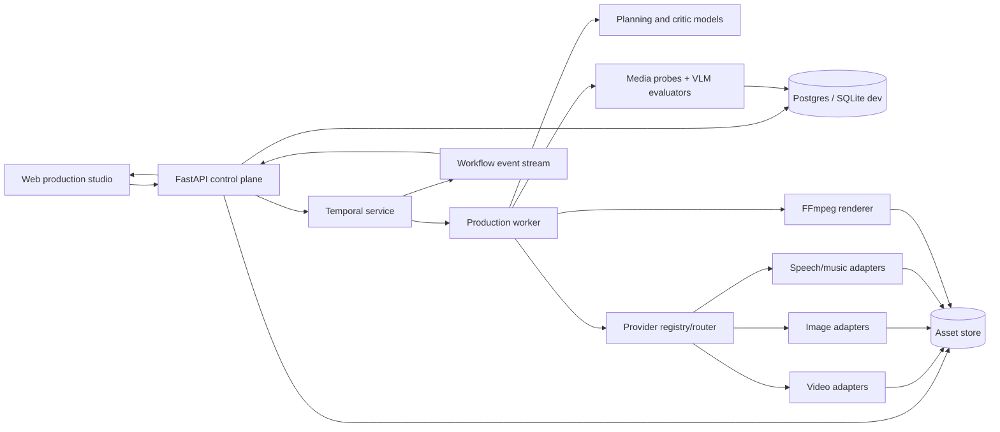

# Renderhaus long-video system design

**Status:** Proposed  
**Last updated:** 2026-07-12  
**Companion documents:** [PRD](../product/long-video-prd.md),
[production manifest](production-manifest.md),
[continuity and evaluation](continuity-and-evaluation.md),
[ADR-0001](../adr/0001-durable-production-workflows.md)

## 1. Executive design

Renderhaus will be a durable production workflow whose intelligence is expressed through typed
planning and critique steps. Agents author or revise production artifacts; workflow code controls
state, side effects, retries, concurrency, approvals, and budget; provider adapters create assets;
deterministic media code assembles the final timeline.

This division combines the demonstrated planning benefits of specialized film-production agents
with production controls that research prototypes generally do not address. MovieAgent structures
director, scene, and shot planning hierarchically ([Wu et al., 2025](https://arxiv.org/abs/2503.07314));
FilmAgent uses iterative feedback between production roles to revise intermediate artifacts
([Xu et al., 2025](https://arxiv.org/abs/2501.12909)); and AesopAgent separates orchestration from a
utility layer of generation capabilities ([Wang et al., 2024](https://arxiv.org/abs/2403.07952)).
Renderhaus adopts those separations but makes the orchestration deterministic and durable.

## 2. Architectural principles

1. **The manifest is truth.** Chat is an input and explanation surface, not workflow state.
2. **Plan hierarchically.** Brief → treatment → beats → scenes → shots → attempts → timeline.
   MovieBench and MovieAgent both use hierarchical movie/scene/shot representations
   ([MovieBench](https://openaccess.thecvf.com/content/CVPR2025/html/Wu_MovieBench_A_Hierarchical_Movie_Level_Dataset_for_Long_Video_Generation_CVPR_2025_paper.html),
   [MovieAgent](https://arxiv.org/abs/2503.07314)).
3. **Generate short, assemble long.** Current commercial and research systems remain strongest at
   short clips; the long-video survey reports common consistency and diversity failures beyond the
   short-shot regime ([Elmoghany et al., 2025](https://openaccess.thecvf.com/content/ICCV2025W/LongVid-Foundation/html/Elmoghany_A_Survey_on_Long-Video_Storytelling_Generation_Architectures_Consistency_and_Cinematic_ICCVW_2025_paper.html)).
4. **Condition on verified memory.** Rejected takes never update canonical continuity. VideoMemory,
   StoryMem, and EntityBench all support explicit compact entity memory
   ([VideoMemory](https://arxiv.org/abs/2601.03655), [StoryMem](https://arxiv.org/abs/2512.19539),
   [EntityBench](https://arxiv.org/abs/2605.15199)).
5. **Evaluate locally and globally.** Shot quality cannot prove transition or narrative quality;
   DirectorBench explicitly identifies the between-unit bottleneck
   ([Chen et al., 2026](https://arxiv.org/abs/2605.30090)).
6. **No unbounded loops.** Every generation and critique loop has attempt, cost, and wall-clock
   limits.
7. **Paid side effects are idempotent.** A retry must retrieve an existing provider task when its
   idempotency key has already been submitted.
8. **Regenerate the smallest dependency cone.** Editing one unlocked shot invalidates its take,
   adjacent transition checks, scene mix, and final render—not unrelated shots.
9. **Providers are replaceable.** Capability discovery and routing live above vendor adapters.
10. **Every result is reproducible and attributable.** Store prompts, models, references, policy
    decisions, seeds when supported, checksums, costs, evaluators, and media commands.

## 3. Context and current-state delta

Today the web agent is intentionally limited to one immediate video tool call and explicitly
forbids audio and music (`agent/service.py`). The API represents one job, one provider job, and one
output path (`web/app.py`). The async task loop can resume polling a submitted clip after restart,
but it cannot replay a graph of planning, parallel generation, evaluation, approval, and assembly.
The Seedance MCP already provides a useful asynchronous provider boundary; Gemini TTS is a dry-run
stub.

The migration should preserve the existing single-clip path as a “Quick clip” workflow while the
new `/api/productions` boundary handles long-form projects. This reduces regression risk and lets
the team reuse the current provider integration during the first sprint.

## 4. Logical architecture



### 4.1 Control plane

FastAPI validates requests, authenticates users, authorizes assets, writes commands, starts or
signals workflows, and streams sanitized events. It never performs long provider polls or media
renders inside the request lifecycle.

### 4.2 Workflow plane

Temporal owns the durable production state machine. Temporal’s official contract is recovery from
process, network, and infrastructure failures, including executions lasting days or longer
([Temporal documentation](https://docs.temporal.io/)). Workflow code contains deterministic
branching only; network, filesystem, database, LLM, and subprocess operations run as activities.

### 4.3 Intelligence plane

Planning nodes receive a typed artifact and emit a typed patch plus rationale and confidence.
They cannot call arbitrary generation tools. This retains specialized responsibilities similar to
MovieAgent and FilmAgent while preventing hidden side effects
([MovieAgent](https://arxiv.org/abs/2503.07314),
[FilmAgent](https://arxiv.org/abs/2501.12909)).

Suggested nodes:

- `normalize_brief`
- `write_treatment`
- `plan_scenes`
- `build_continuity_bible`
- `plan_shots`
- `plan_audio`
- `critique_plan`
- `compile_generation_spec`
- `critique_take`
- `critique_sequence`
- `propose_repair`

Each node uses schema validation, bounded retries for malformed output, and a recorded model/prompt
version. A separate deterministic policy decides whether the proposal is allowed to mutate state.

### 4.4 Provider plane

Adapters implement a common interface:

```python
class VideoProvider(Protocol):
    def capabilities(self) -> VideoCapabilities: ...
    async def estimate(self, spec: ShotGenerationSpec) -> CostEstimate: ...
    async def submit(self, spec: ShotGenerationSpec, idempotency_key: str) -> ProviderTask: ...
    async def status(self, provider_task_id: str) -> ProviderTaskStatus: ...
    async def cancel(self, provider_task_id: str) -> CancelResult: ...
    async def download(self, provider_task_id: str) -> AssetDescriptor: ...
```

Capabilities include duration range, aspect ratios, resolutions, native audio, text/image/video/
audio references, first/last frame controls, extension, policy restrictions, queue class, cost
formula, and concurrency limits. Seedance’s official API accepts multiple reference modalities and
sample task IDs, while Veo 3.1 offers reference images, first/last frames, and iterative extension
([BytePlus API](https://docs.byteplus.com/en/docs/ModelArk/1520757),
[Veo 3.1 documentation](https://ai.google.dev/gemini-api/docs/veo)). This variation is why routing
must depend on capabilities, not provider names embedded in prompts.

### 4.5 Media plane

Assets are immutable blobs addressed by checksum. Logical roles—`character_master`,
`shot_start_frame`, `take_video`, `dialogue_stem`, `preview_proxy`, `final_master`—point to immutable
asset versions. FFprobe verifies media before registration. FFmpeg performs normalization,
trimming, transitions, overlays, captions, mixing, and encoding using recorded templates. FFmpeg’s
official concat mechanisms support deterministic multi-input assembly
([FFmpeg FAQ](https://ffmpeg.org/faq.html)).

## 5. Production workflow

```mermaid
stateDiagram-v2
    [*] --> Draft
    Draft --> Planning: submit brief
    Planning --> PlanReview: typed plan complete
    PlanReview --> Planning: request revision
    PlanReview --> Storyboarding: approve plan
    Storyboarding --> StoryboardReview: keyframes complete
    StoryboardReview --> Storyboarding: revise boards
    StoryboardReview --> CostReview: approve boards
    CostReview --> Rendering: approve spend
    Rendering --> Evaluating: candidate takes available
    Evaluating --> Repairing: bounded defects
    Repairing --> Evaluating: replacement takes
    Evaluating --> Editing: selected takes pass
    Editing --> FinalReview: preview and whole-film QC
    FinalReview --> Editing: timeline/audio revision
    FinalReview --> Repairing: shot repair
    FinalReview --> Complete: approve export
    Draft --> Canceled
    Planning --> Failed
    Storyboarding --> Failed
    Rendering --> Failed
    Editing --> Failed
    Failed --> Planning: resume from recoverable checkpoint
```



### 5.1 Planning phase

Activities generate and validate the brief, treatment, scenes, continuity entities, shots, audio
plan, and cost range. Duration allocation is deterministic after the model proposes weights:
runtime minus title/end cards and transition overlaps is distributed across shots, rounded to frame
boundaries, then reconciled so the sum is exact.

### 5.2 Storyboard phase

Generate canonical character/location/prop sheets first, then scene boards and shot start/end
frames. DreamFactory’s Key Frames Iteration Design and NVIDIA’s Video Storyboarding both motivate
keyframe anchoring for consistency
([DreamFactory](https://arxiv.org/abs/2408.11788),
[Video Storyboarding](https://research.nvidia.com/labs/par/video_storyboarding/)). Storyboard assets
are independently lockable. Approval freezes their versions into the render baseline.

### 5.3 Render phase

The router builds a `ShotGenerationSpec` from the locked shot and memory pack. Independent shots
run concurrently subject to provider, project, and budget semaphores. Hero shots may request two
candidates; low-risk inserts request one. The workflow records the idempotency key before provider
submission and persists the provider task ID immediately afterward.

### 5.4 Evaluation and repair phase

Technical probes run first because they are cheap. Only valid media reaches VLM evaluation. The
critic scores local shot criteria, compares verified entity references, and evaluates adjacent
transitions. VBench’s factorized metrics motivate separate scores
([Huang et al., 2024](https://openaccess.thecvf.com/content/CVPR2024/html/Huang_VBench_Comprehensive_Benchmark_Suite_for_Video_Generative_Models_CVPR_2024_paper.html));
EntityBench motivates separating entity presence, fidelity, and overall cross-shot consistency
([He et al., 2026](https://arxiv.org/abs/2605.15199)).

Policy selects, repairs, falls back, or escalates. The critic cannot call generation directly.

### 5.5 Editorial phase

Generate narration early enough that final shot durations can conform to spoken timing. Assemble
proxy video, captions, dialogue, ambience, SFX, and music stems. ReelWave’s distinction between
temporally synchronized on-screen sound and complementary off-screen sound supports separate audio
roles and controls ([Wang et al., 2025](https://arxiv.org/abs/2503.07217)). A final sequence critic
checks narrative coverage, pacing, long-range entities, transitions, audio, captions, and output
spec before the master encode.

## 6. Commands and APIs

### Production commands

- `POST /api/productions` — create draft from brief.
- `POST /api/productions/{id}/commands/plan`
- `POST /api/productions/{id}/commands/approve-plan`
- `POST /api/productions/{id}/commands/approve-storyboard`
- `POST /api/productions/{id}/commands/approve-cost`
- `POST /api/productions/{id}/commands/pause`
- `POST /api/productions/{id}/commands/resume`
- `POST /api/productions/{id}/commands/cancel`
- `POST /api/shots/{id}/commands/lock`
- `POST /api/shots/{id}/commands/regenerate`
- `POST /api/shots/{id}/commands/select-take`
- `POST /api/timeline/{id}/commands/render`

Commands require a client-generated idempotency key. Responses return accepted workflow revision,
not completion.

### Queries

- `GET /api/productions/{id}` — summary and current revision.
- `GET /api/productions/{id}/manifest`
- `GET /api/productions/{id}/events?after={sequence}`
- `GET /api/productions/{id}/costs`
- `GET /api/scenes/{id}/shots`
- `GET /api/shots/{id}/attempts`
- `GET /api/assets/{id}` — authorized metadata or media stream.

SSE is sufficient for initial progress streaming because commands remain ordinary HTTP requests.
Events use monotonic sequence numbers so clients reconnect without losing updates.

## 7. Persistence and consistency

### Transactional database

Use SQLite for the first local prototype and Postgres before multi-user deployment. Store production
entities, revisions, commands, workflow bindings, provider tasks, evaluations, costs, and asset
metadata relationally. Persist large model inputs/outputs as compressed JSON artifacts referenced
from the row when needed for audit.

### Object storage

Local `.renderhaus/media` remains the development backend. Production uses S3-compatible storage
with checksum keys, short-lived signed URLs, server-side encryption, lifecycle policies, and a
quarantine area for unverified downloads.

### Outbox

Database mutations that must emit events use a transactional outbox. Consumers are idempotent by
event ID. Temporal remains authoritative for execution; the application database remains
authoritative for user-visible production state. Workflow activities reconcile them using
revision compare-and-set.

## 8. Failure and retry policy

| Failure | Default behavior |
|---|---|
| LLM timeout/rate limit | Exponential retry within activity; no state mutation until valid typed output. |
| LLM invalid schema | One repair prompt, then fail node with inspectable validation errors. |
| Provider submit timeout before ID | Query by idempotency key where supported; otherwise mark `submission_unknown` and require reconciliation before retry. |
| Provider generation failure | Retry only if classified transient and budget permits; otherwise route fallback or request review. |
| Provider poll failure | Durable timer and retry; never resubmit generation. |
| Download corruption | Redownload same provider result and verify checksum/container. |
| Evaluator failure | Retry evaluator; asset remains `unevaluated`, never implicitly accepted. |
| FFmpeg failure | Preserve inputs and command manifest; rerun deterministically after correction. |
| Worker crash | Temporal resumes from recorded history without repeating completed activities. |
| Budget exceeded | Pause on approval signal before further paid submissions. |

Temporal’s durable execution and activity model directly support recovery across process and
network failures ([Temporal](https://docs.temporal.io/)); Google’s reference agent demonstrates
persisting both model and tool steps to avoid incorrect repetition
([Google](https://ai.google.dev/gemini-api/docs/temporal-example)).

## 9. Security, rights, and safety

- Validate content type by bytes, not filename; probe all media in quarantine.
- Resolve and authorize asset IDs; never expose provider URLs or arbitrary local paths.
- Prevent path traversal and shell interpolation; FFmpeg receives argument arrays, never generated
  shell strings.
- Store provider credentials in environment/secret management and redact them from events.
- Enforce per-project budget, concurrency, file size, runtime, and attempt quotas.
- Record reference provenance, ownership/consent attestations, policy checks, and model restrictions.
- Treat remote media URLs as SSRF inputs: allow approved providers, cap redirects/size/time, and
  block private network ranges.
- Sanitize captions and metadata; escape drawtext/subtitle inputs through files, not command text.
- Make deletions tombstoned and auditable; schedule blob deletion only after reference checks.

## 10. Observability and operations

Every operation carries `production_id`, `workflow_id`, `scene_id`, `shot_id`, `attempt_id`,
`provider_task_id`, and `trace_id` when applicable. Emit:

- Phase and shot latency histograms.
- Provider success, failure, queue, and policy-rejection rates.
- LLM schema-repair and critic disagreement rates.
- First-pass and final quality distributions.
- Attempt counts and regeneration cost ratios.
- Workflow replay, stuck-task, and reconciliation counters.
- Final render speed, codec errors, and asset-download failures.

Keep immutable prompt/model/tool provenance for reproducibility, but place user content behind
access controls and retention policies. Public errors are stable codes; sensitive provider detail
stays in protected logs.

## 11. Testing strategy

1. **Schema tests:** fixtures and migrations for every manifest version.
2. **Planning property tests:** timings sum exactly; entity references resolve; no dependency cycle.
3. **Workflow replay tests:** history replays deterministically after code changes.
4. **Activity idempotency tests:** repeated command/provider/download calls produce one side effect.
5. **Provider contract tests:** dry-run and recorded HTTP responses for capability, submit, poll,
   cancel, download, and errors.
6. **Media golden tests:** deterministic probe, concat, captions, audio mix, and duration fixtures.
7. **Evaluator calibration:** human-labeled shot and transition set; track false accept/reject rates.
8. **Chaos tests:** terminate API/worker/database connection during every paid-operation boundary.
9. **Acceptance film:** the scenario specified in the PRD.

The evaluation suite borrows factorization from VBench, long-range entity schedules from
EntityBench, and sequence/audio checkpoints from DirectorBench
([VBench](https://openaccess.thecvf.com/content/CVPR2024/html/Huang_VBench_Comprehensive_Benchmark_Suite_for_Video_Generative_Models_CVPR_2024_paper.html),
[EntityBench](https://arxiv.org/abs/2605.15199),
[DirectorBench](https://arxiv.org/abs/2605.30090)). It is not claimed to reproduce those benchmark
scores; it adapts their failure taxonomy to Renderhaus.

## 12. Rollout

- Feature flag `/api/productions` and leave quick clips unchanged.
- Begin with dry-run manifests and recorded provider fixtures.
- Enable live storyboards, then a two-shot live canary, then 30-second, 90-second, and 180-second
  internal productions.
- Require approval for all spend until cost estimates stay within 20% of actual cost for 20 runs.
- Promote each genre separately after its acceptance suite passes.
- Maintain a provider kill switch and per-provider concurrency override.
