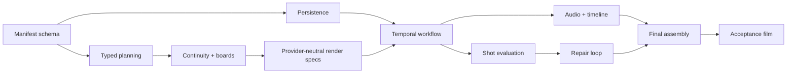

# Renderhaus long-video delivery plan

**Schedule:** 2026-07-13 through 2026-10-02  
**Cadence:** Six two-week milestones  
**Team:** `videogen-serving`  
**Linear project:** [Renderhaus](https://linear.app/fuck-tcf/project/renderhaus-a39791d4c15a)

## 1. Delivery objective

Ship a reliable 60–180 second production workflow that creates an editable script/storyboard,
renders short provider-backed shots with explicit continuity, evaluates and repairs defects, mixes
audio, assembles a final MP4, and survives worker restarts without duplicate paid calls.

The sequence follows the dependency structure supported by the literature: hierarchical planning
before generation ([MovieAgent](https://arxiv.org/abs/2503.07314)); keyframes and explicit memory
before multi-shot continuity ([Video Storyboarding](https://research.nvidia.com/labs/par/video_storyboarding/),
[VideoMemory](https://arxiv.org/abs/2601.03655)); factorized evaluation before repair
([VBench](https://openaccess.thecvf.com/content/CVPR2024/html/Huang_VBench_Comprehensive_Benchmark_Suite_for_Video_Generative_Models_CVPR_2024_paper.html));
and durable execution around long external operations ([Temporal](https://docs.temporal.io/)).

## 2. Ownership model

Two workstreams may proceed concurrently:

- **Platform/workflow:** domain model, persistence, Temporal, provider adapters, costs, FFmpeg,
  reliability, and observability.
- **Creative/product:** planner prompts/schemas, continuity bible, storyboard UX, evaluator rubrics,
  approval UX, and acceptance films.

Every issue has one directly responsible individual, one reviewer, acceptance criteria, evidence
links, and dependency relations. Assignment in Linear is an initial load split, not a statement of
exclusive expertise; rebalance during Sprint 0 after team confirmation.

## 3. Definition of ready

An issue is ready when it has:

- User or system outcome.
- Explicit scope and non-goals.
- Acceptance criteria that can be demonstrated or tested.
- Dependencies and required schema/API decisions.
- Relevant design-doc section and research evidence.
- Estimate small enough to finish inside one milestone; otherwise split.

## 4. Definition of done

- Code and migrations are reviewed.
- Tests proportional to risk pass.
- Structured logs/metrics exist for new workflow behavior.
- User-visible errors are safe and actionable.
- Documentation and fixtures reflect the implemented schema/API.
- Paid provider behavior is dry-run/recording tested before live canary.
- Acceptance evidence is attached to the issue.

## 5. Milestones

### Sprint 0 — Foundations and contracts

**Dates:** 2026-07-13 to 2026-07-24  
**Outcome:** A dry-run brief becomes a validated, exactly timed production manifest.

Deliverables:

- Domain package and schema v1.
- SQLite persistence with migrations and repository layer.
- `/api/productions` command/query skeleton.
- Typed Director/Writer planning pipeline.
- Exact duration reconciler and dependency graph.
- Cost-policy and approval model.
- Fixtures, contract tests, and manifest export.

Exit gate: three representative briefs produce deterministic-valid manifests; durations sum to the
requested frame; all entity references resolve; no paid generation occurs.

### Sprint 1 — Storyboards and continuity

**Dates:** 2026-07-27 to 2026-08-07  
**Outcome:** An approved plan produces canonical entities, shot boards, and bounded memory packs.

Deliverables:

- Continuity bible and versioned entity state.
- Character/location/prop/style canonical asset workflow.
- Shot start/end keyframes through the existing image provider.
- Memory-pack retrieval and verified-only update policy.
- Storyboard grid, edit, lock, and approval UI.
- Seedance adapter expansion for provider-neutral multimodal references.

Exit gate: a 12-shot storyboard preserves one character and two locations under blind review and
exports complete provenance.

### Sprint 2 — Durable parallel rendering

**Dates:** 2026-08-10 to 2026-08-21  
**Outcome:** Approved shots render concurrently and recover safely from process failure.

Deliverables:

- Temporal local/dev infrastructure.
- Production workflow and idempotent activity library.
- Provider task ledger and submission reconciliation.
- Bounded shot concurrency and budget semaphore.
- Pause/resume/cancel and approval signals.
- SSE event stream and per-shot progress UI.
- Chaos and workflow replay tests.

Exit gate: terminate API and worker during a live or recorded multi-shot run; restart and finish with
zero duplicated provider submissions.

### Sprint 3 — Editorial and audio

**Dates:** 2026-08-24 to 2026-09-04  
**Outcome:** Selected shots become a frame-accurate narrated preview and final master.

Deliverables:

- Live narration provider and duration-aware script segmentation.
- Music/SFX plan and provider integration.
- Immutable asset store and FFprobe validation.
- FFmpeg normalization, concat, transitions, captions, stems, ducking, loudness, proxy, and master.
- Timeline manifest and render provenance.
- Shot replacement with minimal invalidation.

Exit gate: deterministic 90-second preview and master with narration, music, captions, exact runtime,
and successful one-shot replacement.

### Sprint 4 — Evaluation and targeted repair

**Dates:** 2026-09-07 to 2026-09-18  
**Outcome:** Renderhaus detects defects and repairs the smallest affected unit within budget.

Deliverables:

- Media-integrity gates.
- Shot adherence and intra-shot VLM rubric.
- Entity presence/fidelity/state checks.
- Pairwise transition evaluator.
- Scene/film script, visual, audio, cross-modal, and stability evaluation.
- Normalized defect schema, repair planner, bounded retry/fallback policy.
- Human-labeled calibration set and evaluator dashboard.

Exit gate: seeded defects are localized correctly; a continuity failure regenerates only its shot
and downstream transition/final renders.

### Sprint 5 — Product hardening and launch

**Dates:** 2026-09-21 to 2026-10-02  
**Outcome:** Internal beta reliably generates the PRD acceptance film with cost and operational
controls.

Deliverables:

- Full screenplay/storyboard/shot-grid/timeline/issue-queue experience.
- Security review for uploads, remote media, paths, subprocesses, secrets, and authorization.
- Metrics, tracing, stuck-workflow alerts, provider kill switches, and runbooks.
- Cost estimate calibration and budget approval UX.
- 30-second, 90-second, and 180-second canaries.
- Acceptance film, human evaluation, defect review, and release decision.

Exit gate: PRD acceptance test passes twice from clean state, including one chaos interruption and
one localized revision; no unresolved P0 defects.

## 6. Critical path

Do not begin autonomous repair before immutable attempts, evaluation schemas, and dependency
invalidation exist. Do not enable multi-shot live spend before idempotency and crash recovery pass.

## 7. Quality gates by environment

| Environment | Allowed work | Required gates |
|---|---|---|
| Unit/CI | No network or paid calls | Schema, property, replay, provider fixture, media golden tests |
| Local dry run | Planning and synthetic tasks | Valid manifest, exact duration, cost estimate, approval binding |
| Recorded provider | Replayed API responses/media | Idempotency, polling, download, evaluation, assembly |
| Live canary | Bounded internal prompts | Explicit spend approval, provider kill switch, full provenance |
| Internal beta | Approved users/formats | Acceptance suite, security checks, monitoring and runbooks |

## 8. Team operating rhythm

- Monday: milestone planning, dependency review, and risk updates.
- Daily: async update on outcome, blocker, and next executable slice.
- Wednesday: integration demo using a shared acceptance-film fixture.
- Friday: live artifact review, metric review, and milestone scope adjustment.
- Every architecture change: short ADR or update to an existing ADR.
- Every provider change: capability/contract test and cost-model update.
- Every evaluator change: calibration report; no silent threshold tuning.

## 9. Risk register

| Risk | Trigger | Owner action |
|---|---|---|
| Schema churn blocks workflow | More than one breaking manifest change per sprint | Freeze core v1 after Sprint 0; use additive fields and migrations. |
| Provider behavior differs from docs | Contract/canary failure | Update capability registry, disable path, retain fallback. |
| Duplicate paid work | Same logical activity produces two tasks | Stop live rendering; reconcile ledger; add replay/idempotency regression. |
| Evaluator over-rejects | Human false-reject rate exceeds target | Move criterion into review band; recalibrate; do not simply lower all gates. |
| Continuity memory propagates defects | Rejected look reappears | Audit provenance; enforce selected/verified-only memory invariant. |
| Audio determines different timing late | Narration overflows approved scenes | Move narration synthesis/timing before final video rendering. |
| FFmpeg graph becomes ad hoc | Non-reproducible manual command fixes | Add typed render graph and golden fixture before accepting the fix. |
| Sprint overload | More than 20% work rolls over | Split vertical slices; protect critical path; defer P1. |

## 10. Release decision checklist

- Product promise and limits are visible in the UI.
- Quick clip remains functional.
- Manifest export reproduces the accepted master from immutable inputs.
- All paid provider calls have ledger entries and costs.
- Storyboard and spend approvals bind to exact revisions.
- No duplicate task in chaos suite.
- Major continuity and transition defect recall meets calibrated targets.
- Final film passes technical, narrative, audio, caption, runtime, and policy gates.
- Provider outage and stuck-workflow runbooks have been exercised.
- Data deletion and secret-redaction tests pass.
